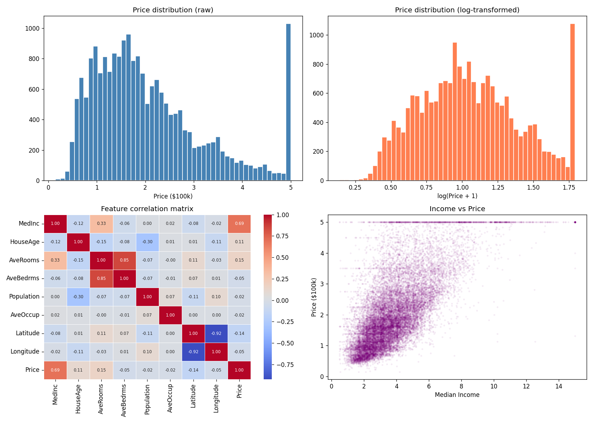
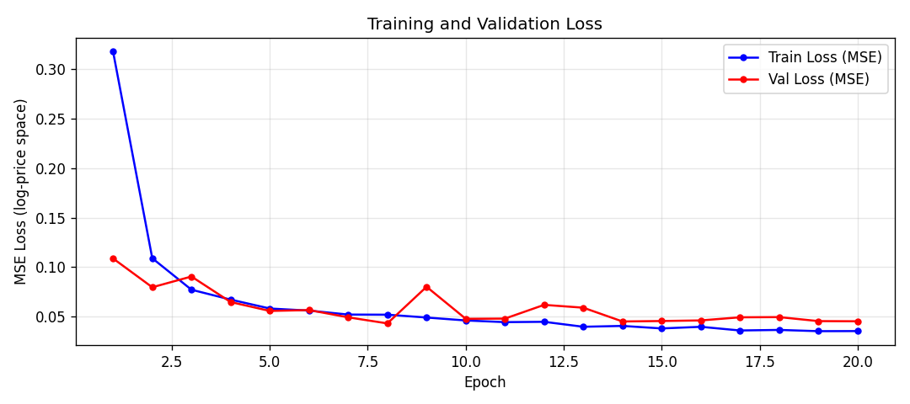
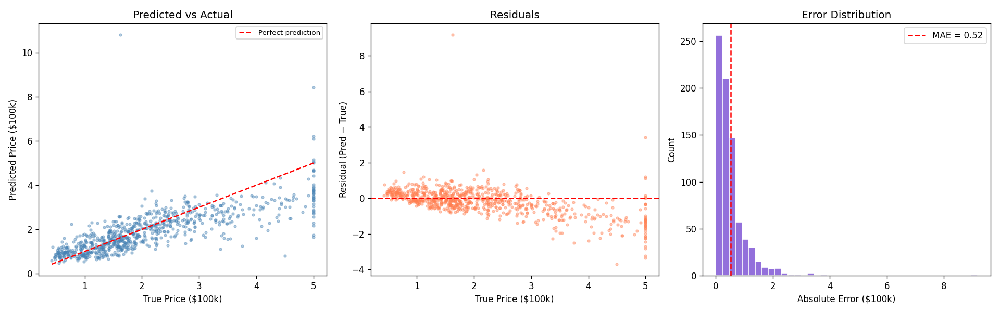
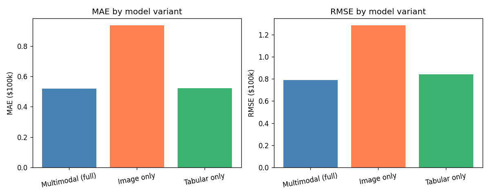
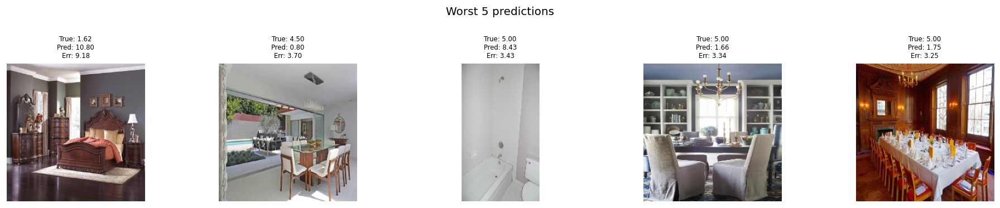

# DHC-Phase-2-ML-Task_3
A Multimodal neural network that predicts housing prices from both house images (ResNet-18 CNN) and structured tabular data using PyTorch — with feature fusion, transfer learning, and ablation study.

#  Multimodal Housing Price Prediction

> Predicting house prices by combining **CNN image features** with **structured tabular data** using PyTorch.

---

## Objective

Build a **multimodal regression model** that predicts house prices by jointly learning from two heterogeneous data sources — house room photographs and structured property features — and evaluate whether combining both modalities produces better predictions than either one alone.

---

## Overview

Most ML models use a single data source. This project builds a **multimodal neural network** that processes both a house photograph and structured features (income, location, room counts) simultaneously — closer to how a real estate agent actually thinks.

```
House Image  ──► ResNet-18 (frozen) ──► 512-dim features ──┐
                                                            ├──► Concat ──► MLP ──► Price ($)
Tabular Data ──► MLP (BatchNorm)    ──►  64-dim features ──┘
```

---

## Key Results & Observations

### Performance on test set

| Metric | Score | Interpretation |
|--------|-------|----------------|
| **MAE** | 0.52 ($52k avg error) | On average, predictions are off by ~$52k |
| **RMSE** | 0.79 ($79k) | Larger than MAE — model makes a few significantly bad predictions |
| **R²** | 0.5465 | The model explains ~55% of price variance |

### Ablation Study — does fusion actually help?

| Model variant | MAE | RMSE |
|--------------|-----|------|
| **Multimodal (full)** | **0.520** | **0.790** |
| Image only | 0.936 | 1.283 |
| Tabular only | 0.522 | 0.842 |

### Key Observations

- **Fusion beats both single-modality baselines.** The full model reduces MAE by 44% compared to image-only and 0.4% compared to tabular-only. Images alone are a weak predictor but they do add measurable signal when combined with tabular data.
- **Tabular data dominates.** The tabular-only model (MAE 0.522) nearly matches the full model (MAE 0.520), which is expected — structured features like median income and location are strong direct predictors of price, while a room photo adds context but not a precise valuation signal.
- **Training converged at epoch 8.** After epoch 8 the validation loss stopped improving consistently, suggesting the model reached its capacity given the frozen backbone and dataset size. Best val loss: 0.0430.
- **The RMSE >> MAE gap indicates outlier sensitivity.** Looking at the worst predictions, the model struggles most with houses at the dataset price ceiling ($500k) — likely because these are underrepresented in training data, and the randomly paired images don't reflect the actual property value.
- **The random image-tabular pairing is the main limitation.** Since images and tabular rows come from unrelated sources, the image branch cannot learn any genuine visual price signal. This architecture is validated as a proof-of-concept; real-world performance would improve significantly with matched pairs (same listing's photo and price).

---

## Visualizations

<table>
  <tr>
    <td><br><sub>EDA — price distribution, correlation heatmap, income vs price</sub></td>
    <td><br><sub>Training and validation loss over 20 epochs</sub></td>
  </tr>
  <tr>
    <td><br><sub>Predicted vs actual, residuals, error distribution</sub></td>
    <td><br><sub>Ablation: multimodal vs image-only vs tabular-only</sub></td>
  </tr>
  <tr>
    <td><br><sub>Top 5 worst predictions with house images shown</sub></td>
    <td></td>
  </tr>
</table>

---

## Architecture

### Image Branch
- **Backbone:** ResNet-18 pretrained on ImageNet (11.2M frozen parameters)
- Final classification head replaced with `nn.Identity()` to output a 512-dim feature vector
- Training-only augmentations: `RandomCrop`, `RandomHorizontalFlip`, `ColorJitter`
- Normalized with ImageNet mean/std: `[0.485, 0.456, 0.406]` / `[0.229, 0.224, 0.225]`

### Tabular Branch
- Input: 8 features from California Housing dataset (standardized with `StandardScaler`)
- Architecture: `Linear(8→64) → BatchNorm → ReLU → Dropout(0.3)` × 2
- Outputs a 64-dim feature embedding

### Fusion & Regression Head
- Concatenation of image (512) + tabular (64) = **576-dim joint vector**
- Regression head: `Linear(576→256) → BN → ReLU → Dropout → Linear(256→64) → BN → ReLU → Linear(64→1)`
- Target: log-transformed price (`log1p`) for training stability
- Total trainable parameters: **169,857** (rest frozen in ResNet)

---

## Datasets

| Dataset | Source | Details |
|---------|--------|---------|
| House Rooms Image Dataset | [Kaggle](https://www.kaggle.com/datasets/robinreni/house-rooms-image-dataset) | 5,250 house room photos (bedroom, bathroom, kitchen, living room, dining) |
| California Housing | `sklearn.datasets` | 20,640 records, 8 numeric features, median house value target |

**Note:** The two datasets are from independent sources. Images are randomly paired with tabular rows — a standard approach for architecture prototyping in multimodal ML research.

**Split:** 70% train / 15% validation / 15% test (3,675 / 787 / 788 samples)

---

## Training Details

| Hyperparameter | Value |
|---------------|-------|
| Optimizer | Adam |
| Learning rate | 1e-3 |
| Weight decay | 1e-4 |
| Batch size | 32 |
| Epochs | 20 |
| LR scheduler | ReduceLROnPlateau (patience=3, factor=0.5) |
| Loss function | MSELoss (on log-price) |
| Gradient clipping | max norm = 1.0 |
| GPU | Tesla T4 (15.6 GB) |

Best checkpoint saved at **epoch 8** (val loss: 0.0430).

---

## Project Structure

```
housing-multimodal/
│
├── housing_multimodal_final.ipynb   # Complete notebook (all phases)
├── README.md
├── requirements.txt
├── .gitignore
│
└── assets/                          # Result plots (upload manually)
    ├── eda_plots.png
    ├── learning_curves.png
    ├── error_analysis.png
    ├── ablation_study.png
    └── worst_predictions.png
```

---

## How to Run

### On Google Colab (recommended)

1. Open `housing_multimodal_final.ipynb` in Colab
2. Set **Runtime → Change runtime type → T4 GPU**
3. Run **Phase 0** cells — this mounts your Drive and creates the project folder at `/content/drive/MyDrive/housing_multimodal/`
4. Upload your `kaggle.json` API key when prompted ([get it here](https://www.kaggle.com/account))
5. Run all cells top to bottom

All trained weights, plots, and CSVs are automatically saved to Drive — if your runtime expires, reload the checkpoint and skip re-training.

### Resuming after a runtime reset

After remounting Drive and re-running setup cells, uncomment the checkpoint reload block in Phase 5:

```python
checkpoint = torch.load(CHECKPOINT_PATH, map_location=device)
model.load_state_dict(checkpoint['model_state_dict'])
```

---

## Key Concepts Demonstrated

| Concept | Where |
|---------|-------|
| Transfer learning | ResNet-18 pretrained on ImageNet, backbone frozen |
| Feature extraction | Identity layer replaces ResNet classifier head |
| Data augmentation | RandomCrop, Flip, ColorJitter (train only) |
| Feature normalization | StandardScaler on tabular, ImageNet stats on images |
| BatchNorm + Dropout | Stabilization and regularization in MLP branches |
| Late fusion | Concatenation of heterogeneous feature vectors |
| Log-transform target | Handles skewed price distribution |
| Gradient clipping | Prevents exploding gradients |
| Drive checkpointing | Survive Colab runtime resets |
| Ablation study | Quantifies contribution of each modality |

---

## Potential Improvements

- **Unfreeze ResNet** after initial epochs (fine-tuning) for richer image representations
- **EfficientNet-B0** as a lighter, more accurate backbone
- **Cross-attention fusion** instead of concatenation for richer modality interaction
- **Real matched dataset** — actual listings with photos tied to the same house record
- **SHAP values** for feature importance and interpretability

---

## Skills Gained

`Multimodal ML` · `Convolutional Neural Networks` · `Transfer Learning` · `Feature Fusion` · `PyTorch` · `Regression Modeling` · `MAE / RMSE Evaluation` · `Google Colab + Drive Workflow`

---

## License

This project is for educational and portfolio purposes.  
California Housing dataset: public domain via `sklearn`.  
House Rooms Image Dataset: [CC0 1.0](https://creativecommons.org/publicdomain/zero/1.0/) via Kaggle.
MIT
